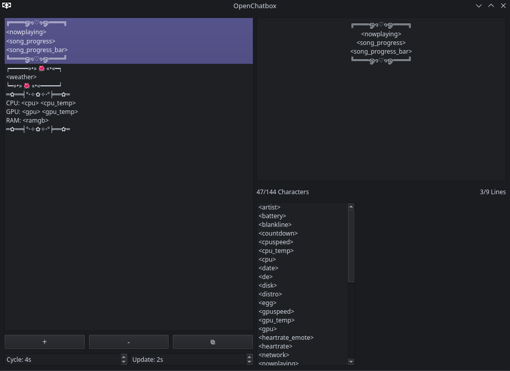

# OpenChatbox

Cross-platform desktop app for sending OSC chatbox messages to VRChat. Write multiple messages, use tokens for live data (heartbeat, now playing, weather, etc.), and the app cycles through them automatically.

Built with Python and PySide6. Works on Linux and Windows.



## Install

### Windows

Grab `OpenChatboxSetup.exe` from the [latest release](https://github.com/ZorudaRinku/OpenChatbox/releases/latest) and run it.

### Linux (Arch):

```bash
yay -S openchatbox        # or paru, or your preferred AUR helper
```

Or manually:

```bash
git clone https://aur.archlinux.org/openchatbox.git
cd openchatbox
makepkg -si
```

### Linux (General)

Download `OpenChatbox-linux.tar.gz` from the [latest release](https://github.com/ZorudaRinku/OpenChatbox/releases/latest) and extract it anywhere. Also, see optional system dependencies below.

```bash
tar xzf OpenChatbox-linux.tar.gz
cd OpenChatbox
./OpenChatbox
```

## Building from source (dev)

Requires Python 3.11+.

```bash
git clone https://github.com/ZorudaRinku/OpenChatbox.git
cd OpenChatbox
make install
make run
```

### Linux optional system dependencies

Some tokens need extra system tools to work. They fail gracefully if the tool isn't installed.

- `playerctl` - now playing, song, artist, song progress
- `nvidia-smi` - GPU stats and temperature
- `xdotool` - active window (X11)
- `hyprctl` / `swaymsg` / `kdotool` - active window (Wayland)
- `nmcli` or `iwgetid` - network info
- `wpctl` or `pactl` - volume

## Usage

1. The left panel is your chat list - add, remove, and reorder messages - Double click messages in list to toggle messages
2. The right panel is the editor for the selected message
3. Double click tokens to add them to the editor
4. Messages have a 144-character / 9-line limit (VRChat's chatbox limit)

Cycle - Time until message switch

Update - Time until message update without switch

### Tokens

Double click or Wrap in angle brackets in your messages and they get replaced with live data each cycle & update.

| Token | What it does |
|---|---|
| `<time>` | Current local time |
| `<date>` | Current date |
| `<timezone>` | Timezone abbreviation |
| `<utc>` | Current UTC time |
| `<cpu>` | CPU usage % |
| `<cpu_speed>` | CPU clock speed |
| `<cpu_temp>` | CPU temperature |
| `<ram>` | RAM usage % |
| `<ramgb>` | RAM usage in GB |
| `<gpu>` | GPU usage % |
| `<gpu_speed>` | GPU clock speed |
| `<gpu_temp>` | GPU temperature |
| `<disk>` | Disk usage % |
| `<battery>` | Battery level % |
| `<network>` | Wi-Fi network name |
| `<volume>` | System volume |
| `<ping>` | Network latency |
| `<window>` | Active window title |
| `<distro>` | Linux distro name |
| `<de>` | Desktop environment |
| `<wm>` | Window manager |
| `<uptime>` | System uptime |
| `<session>` | App session duration |
| `<weather>` | Current weather |
| `<song>` | Current song title |
| `<artist>` | Current artist |
| `<nowplaying>` | Song + artist combined |
| `<song_progress>` | Track position (e.g. 1:23 / 3:45) |
| `<song_progress_bar>` | Visual progress bar for current track |
| `<heartrate>` | Heart rate (Bluetooth) |
| `<heartrate_emote>` | Heart rate as an emote |
| `<twitch_viewers:channel>` | Live Twitch viewer count |
| `<twitch_followers:channel>` | Twitch follower count |
| `<countdown:HH:MM>` | Countdown to a target time |
| `<random:min:max>` | Random number in range |
| `<blankline>` | Empty line |

## Configuration

Settings are stored in `config.toml` at:
- Linux: `~/.config/OpenChatbox/config.toml`
- Windows: `%LOCALAPPDATA%\OpenChatbox\config.toml`

## Contributing

PRs and issues welcome.

If you want to add a new token, create a file in `services/tokens/`, implement the token class, and add it to the `ALL_TOKENS` list in `services/tokens/__init__.py`. Look at an existing token like `time_token.py` for the pattern.

## License

[MIT](LICENSE)
